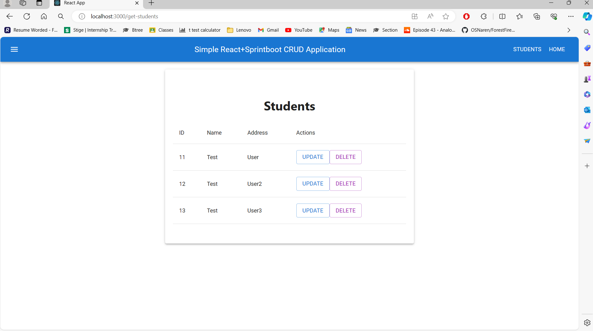
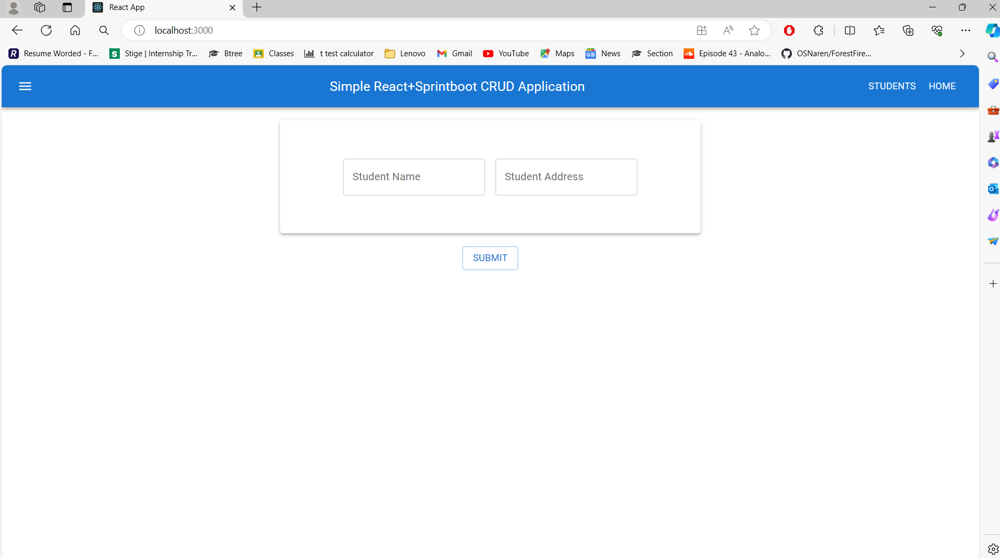

# Sprintboot + React CRUD Application

This is a simple CRUD (Create, Read, Update, Delete) application built with Spring Boot for the backend and React for the frontend. The application is designed for learning purposes to understand the basics of building a full-stack web application using these technologies.

## Features

- Create, read, update, and delete student records.
- Frontend built with React for dynamic and interactive user interface.
- Backend powered by Spring Boot providing RESTful APIs for data manipulation.
- Utilizes Material-UI components for UI design in React.
- Simple and intuitive user experience for managing student data.

